postman testing the api with Xata

testing registration with postman,successful
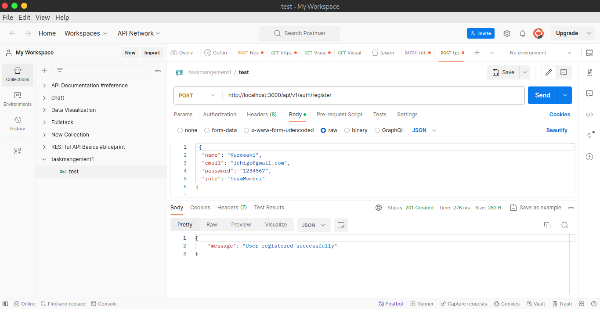

user credentials dont match,login
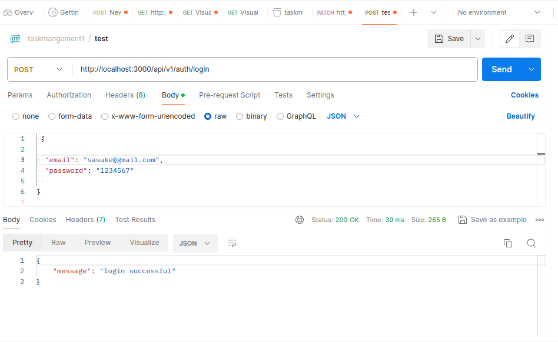
successful login with tokens
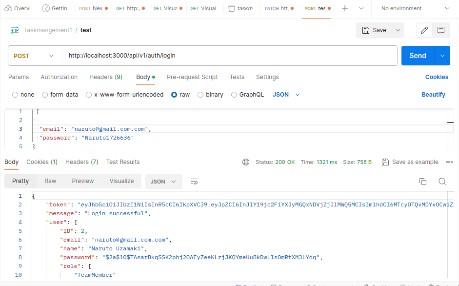
successful creation of task
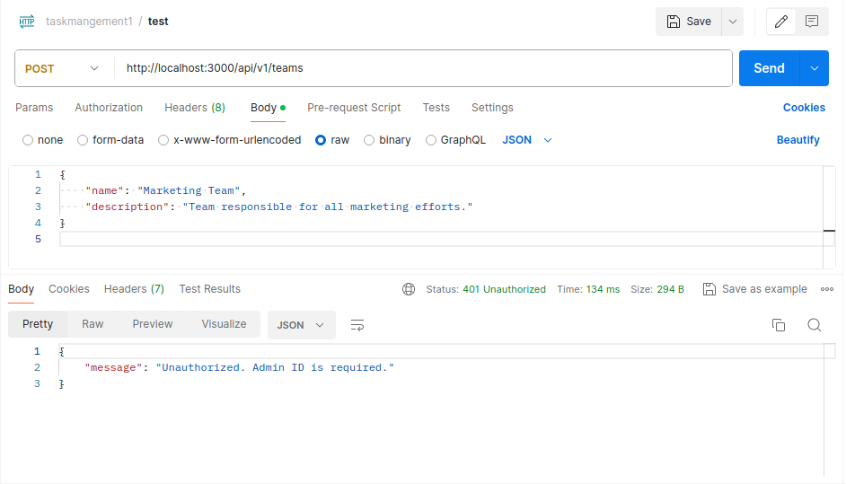
getting available tasks
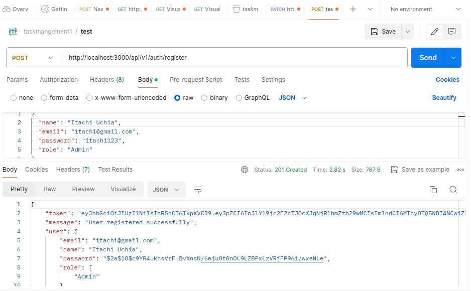
getting a task by id
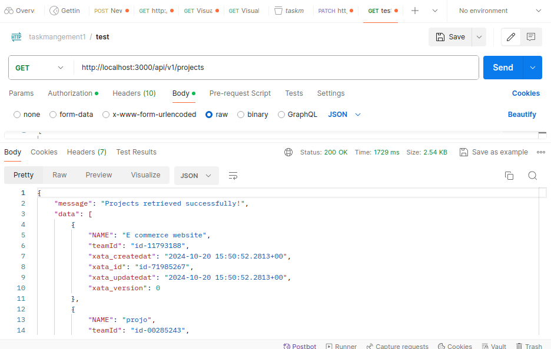
deleting task
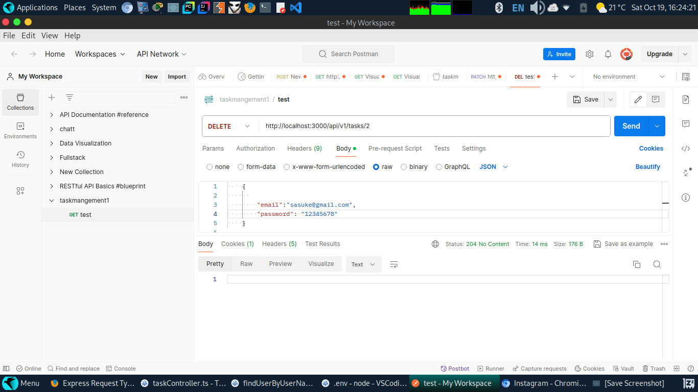
editing a task
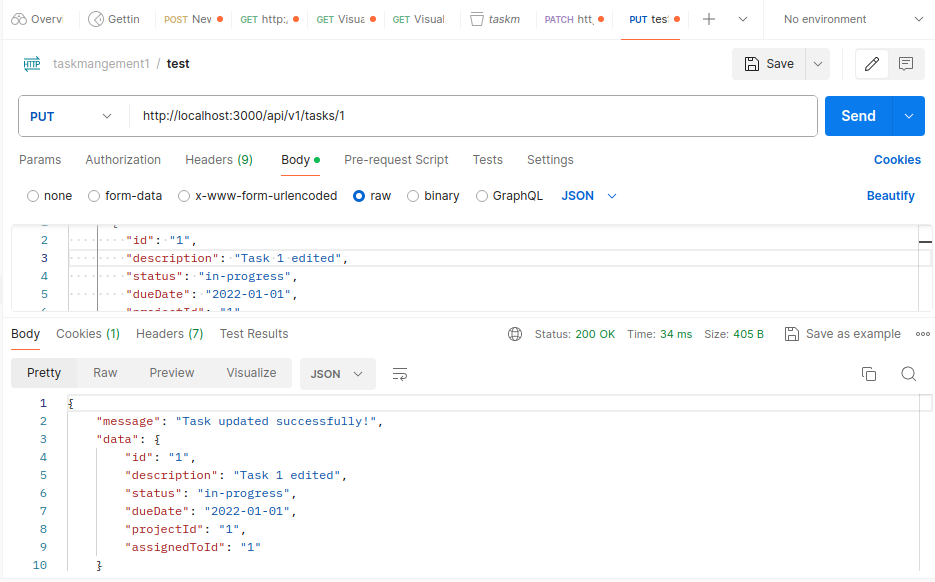
creatind a project
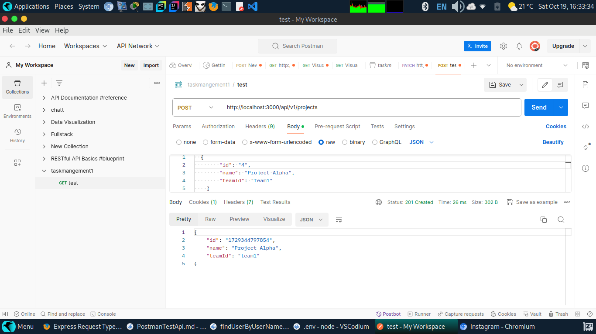
getting all projects
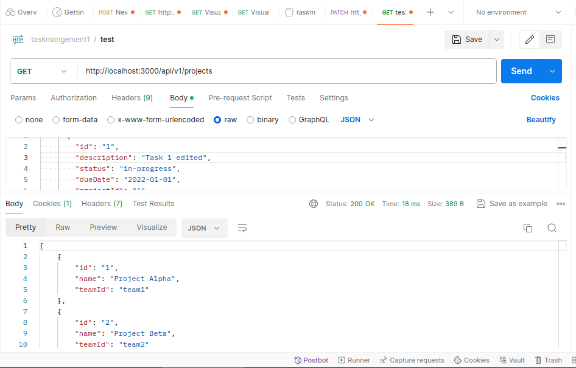
geting a project by id
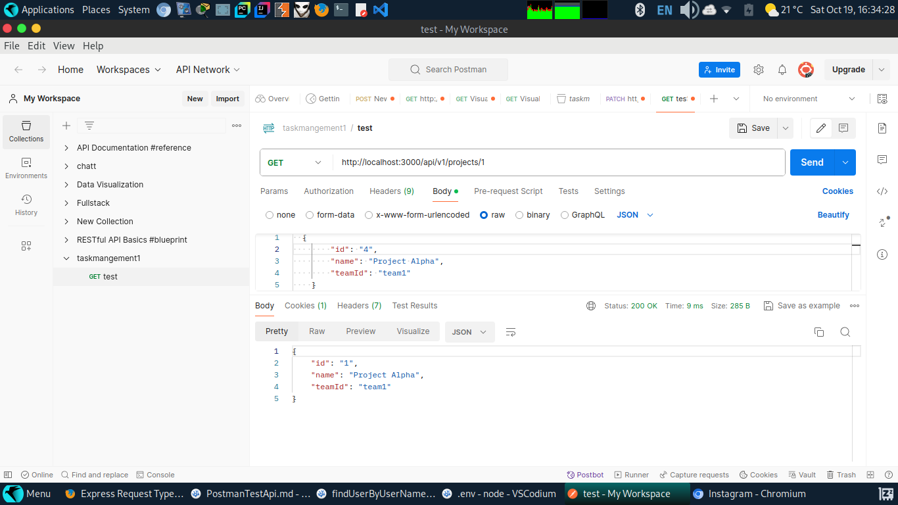
deleting a project
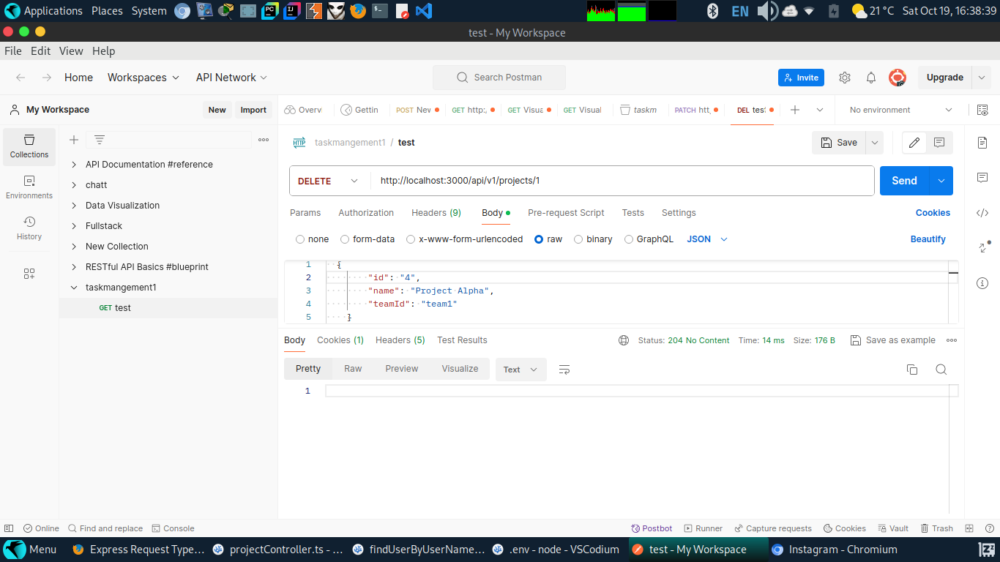
updating an project
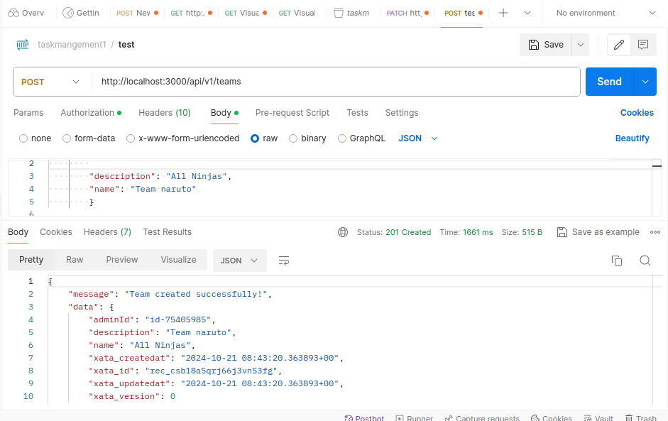

comments
