postman testing the api with Xata

testing registration with postman,successful

registration as admin

user credentials dont match,login

successful login with tokens

tasks

successful creation of task
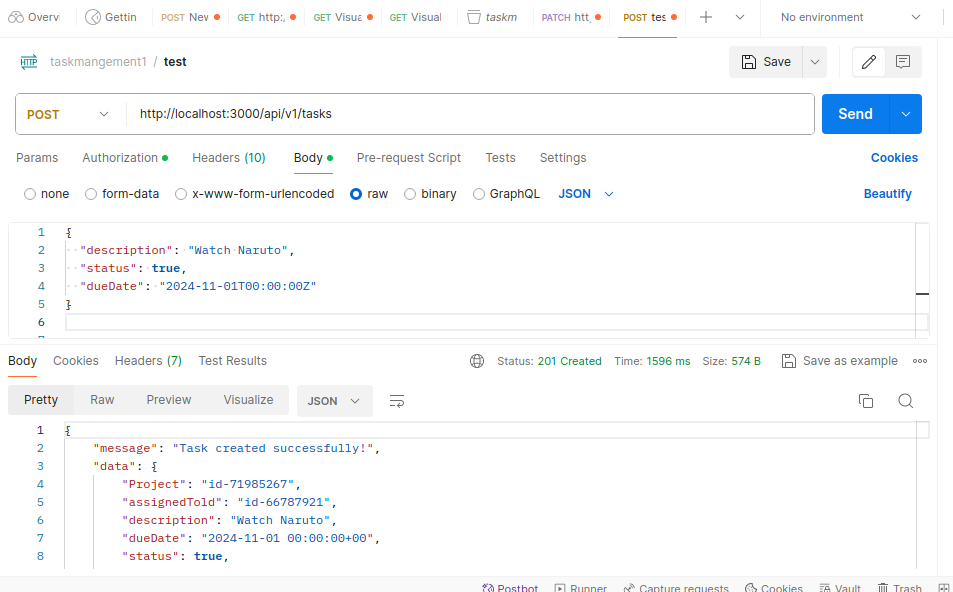
getting available tasks
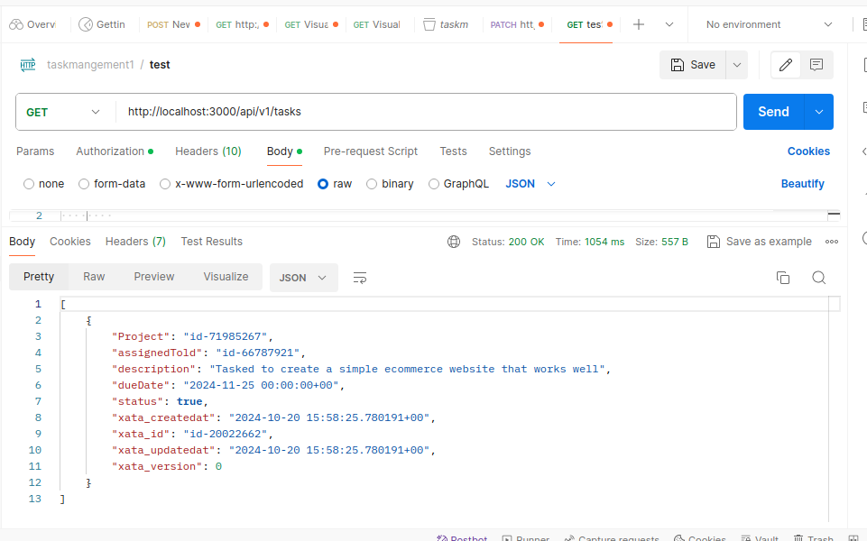
getting a task by id
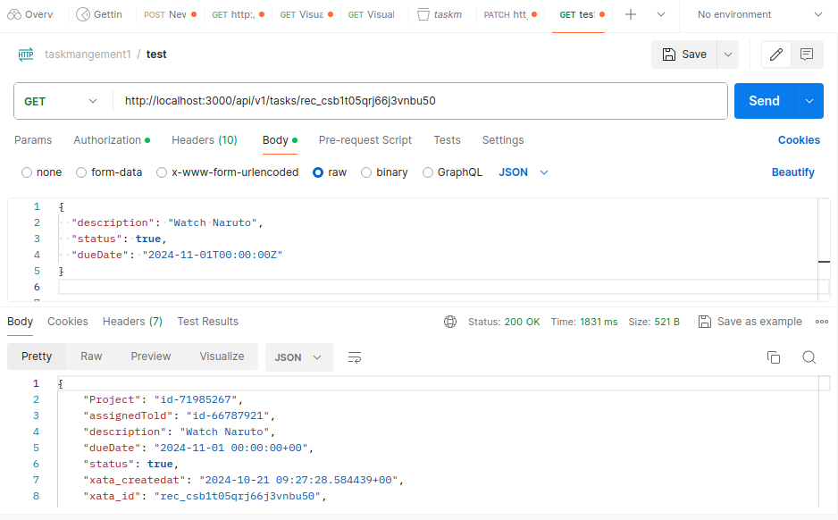
deleting task

editing a task
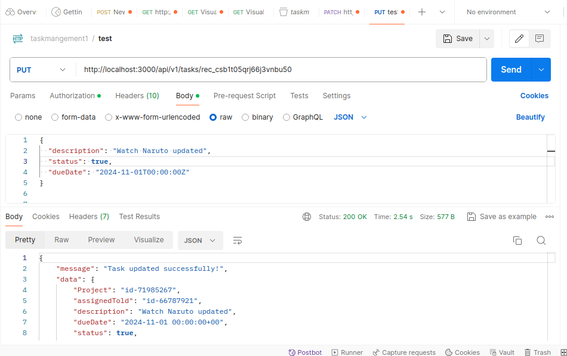
deleting a task
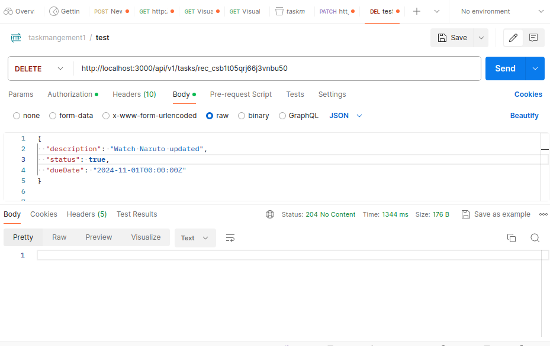

projects
Post:creatind a project
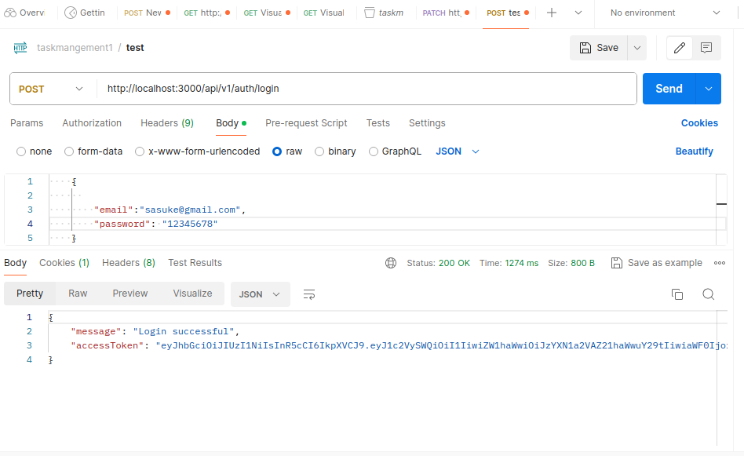
Get:getting all projects

get:geting a project by id

Put:updating a project

delete:deleting a project

updating an project

teams
access control when non-admins try to create a team

teams creation

get:all teams

getting a team by id
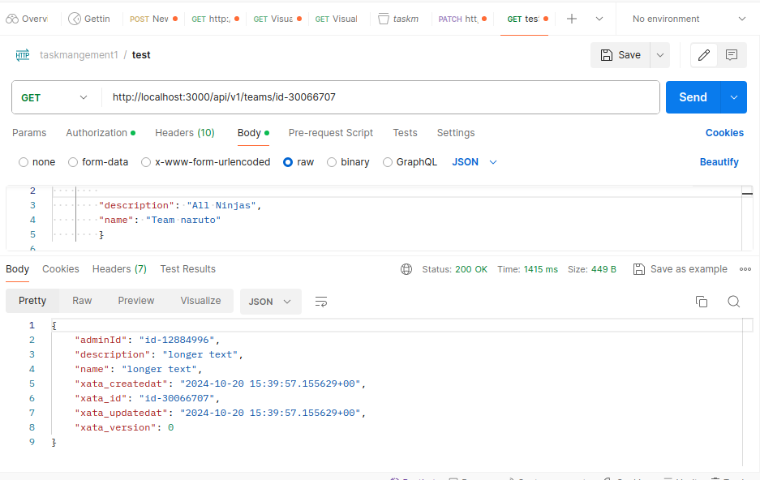
update a team
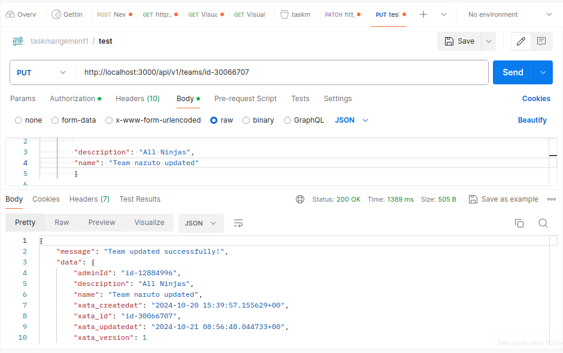
delete team
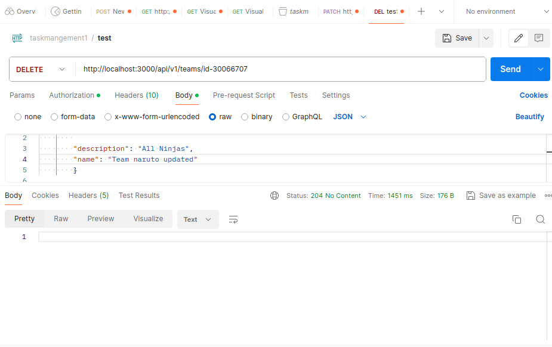

comments
creating a comment
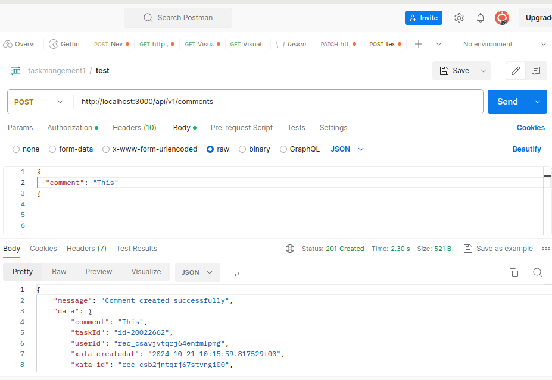
getting all comments

updating a comment
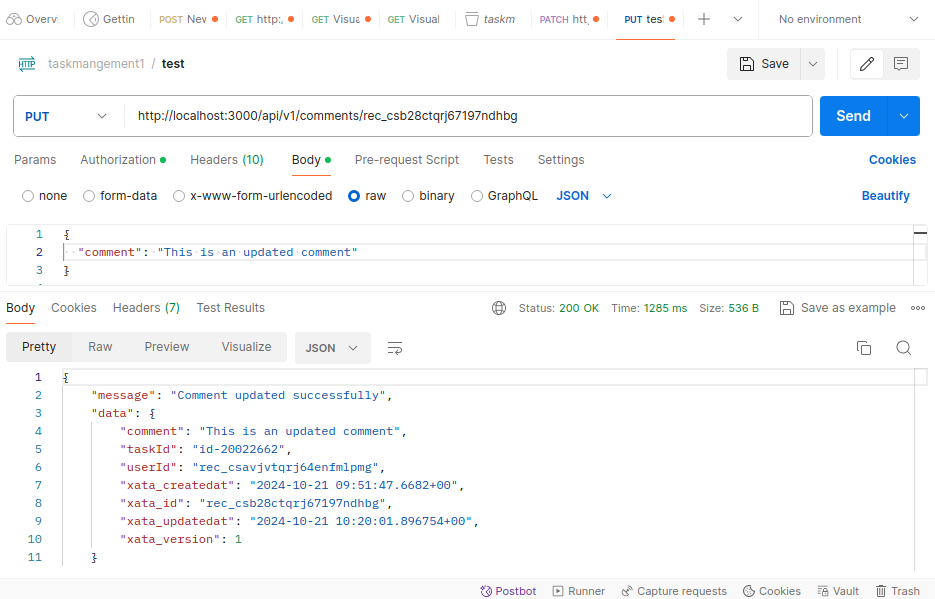
deleteing a comment
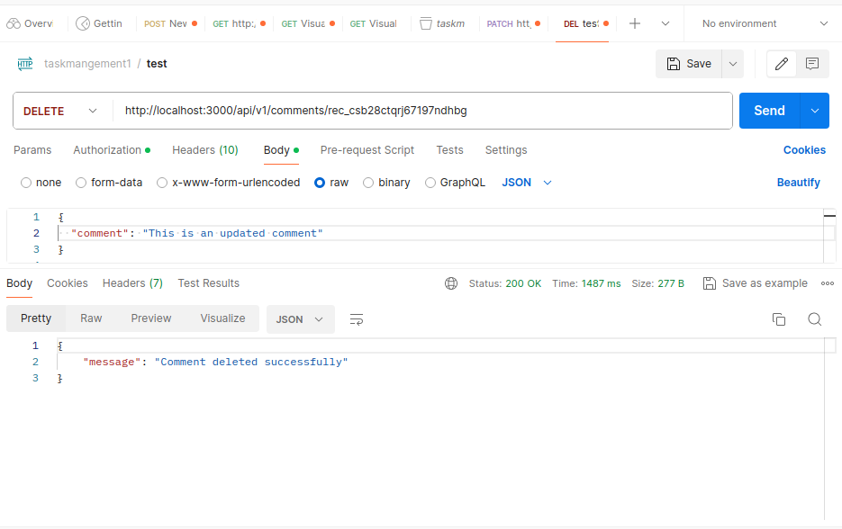
